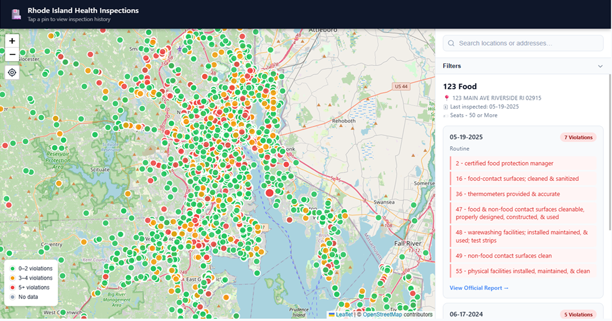

# InspectRI


Interactive map of food safety inspection records for every licensed food establishment in Rhode Island. Live at [inspectri.com](https://inspectri.com).



## Features

- Interactive map with color-coded risk markers (green / amber / red)
- Search by name or address
- Filter by severity, recency, category, and cuisine
- Worst Offenders list (top 50 by risk score)
- Near Me — centers map on your location
- Full violation history for each establishment
- Scores updated daily

## How it works

Inspection data is fetched daily from the [RI Department of Health public inspection portal](https://ri.healthinspections.us). Each violation is looked up against the FDA Food Code 2022 and weighted by severity:

- **Priority (P)** — 3 pts — violations directly linked to foodborne illness
- **Priority Foundation (Pf)** — 2 pts — violations that undermine food safety management
- **Core (C)** — 1 pt — general sanitation and maintenance

The weighted total is converted to a 0–100 score (higher = better) and used to color-code each location on the map.

## Project structure

```
index.html          # Single-page app
css/app.css
js/
  map.js            # Map, markers, filters, tabs
  sidebar.js        # Location list, inspection detail panel
  api.js            # Inspection data fetching
data/
  locations.json    # Cached location + inspection data (~6700 establishments)
scripts/
  refresh.py        # Daily data refresh (incremental + backfill)
  rescore.py        # One-time re-score utility
  fetch_cuisines.py # Google Places cuisine classification
  place_types.py    # Category/cuisine type mappings
.github/workflows/
  refresh-data.yml  # Daily refresh + deploy
  reconcile.yml     # Weekly removal of closed/delisted establishments
  fly-deploy.yml    # Manual deploy to Fly.io
```

## Data refresh

The daily GitHub Actions workflow:
1. Runs `scripts/refresh.py` — fetches new/updated inspections from the RI DOH API, geocodes new locations, and scores violations using FDA Food Code section codes extracted from HTML inspection reports
2. Commits updated `data/locations.json` if changed
3. Deploys to Fly.io

A weekly reconciliation job removes establishments that no longer appear in the RI DOH facilities list.

## Running locally

```bash
python3 dev-server.py
# open http://localhost:8080
```

## Deployment

Deployed on [Fly.io](https://fly.io) as a minimal Python HTTP server serving static files.

```bash
flyctl deploy --remote-only
```

## Environment variables

| Variable | Used by | Purpose |
|---|---|---|
| `GOOGLE_MAPS_KEY` | `refresh.py` | Geocoding and Google Places classification |
| `FLY_API_TOKEN` | GitHub Actions | Fly.io deployment |

## Disclaimer

This project is not affiliated with or endorsed by the Rhode Island Department of Health. Scores are computed by this site based on public inspection records and are not official RIDOH ratings. See the [About page](https://inspectri.com) for full disclaimer.
